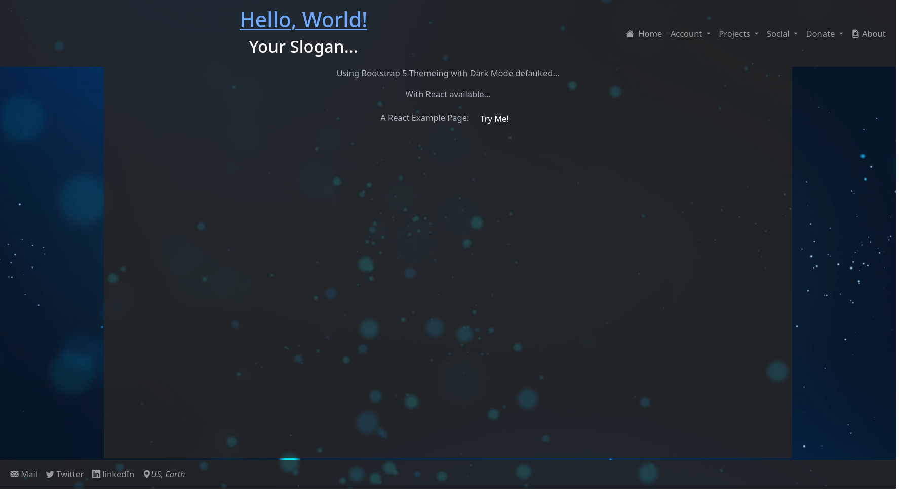

# Flask-Project-Template
A template to quickly standup a Flask app with Bootstrap 5, React, OIDC IAM, and a database.

# Dependencies
``` sudo apt install python3 ```

# Setup
*** Change directory to Flask-Project-Template/ or rename the folder before doing so. Then either run the create_venv.sh script. For windows, you'll need git bash. You can also just create the venv yourself and pip install the dependencies thereafter.

*** To start the application:

Linux/Mac
``` ./linux-start.sh ```

Windows
``` ./windows-start.sh ```


# Images


# Notes
* Make sure to change the port in the start script as needed.
* You can change the login route by changing the 'LOGIN_PATH' variable in the __init__.py file in the 'core' directory.
* Get [Keycloak](https://www.keycloak.org) to use oidc login route.
* If using Keycloak, make sure to change the client_secrets.json file values to match your Keycloak settings. Or, match Keycloak settings to the client_secrets.json file.
* Have fun!
